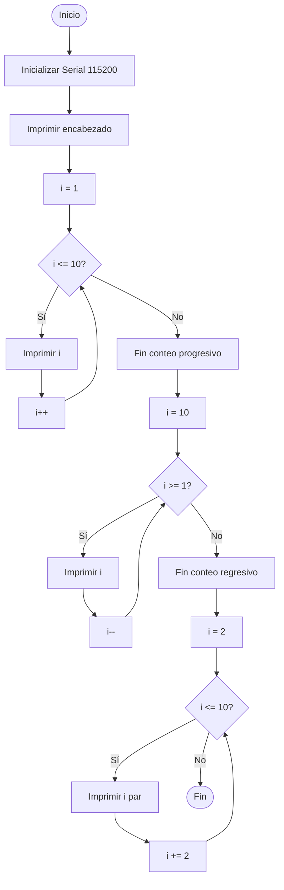
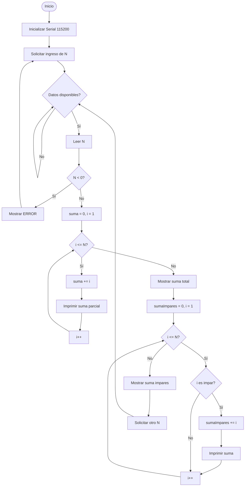
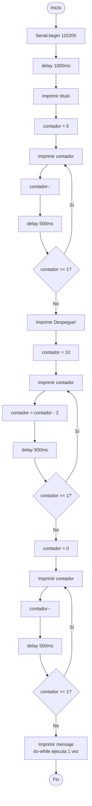
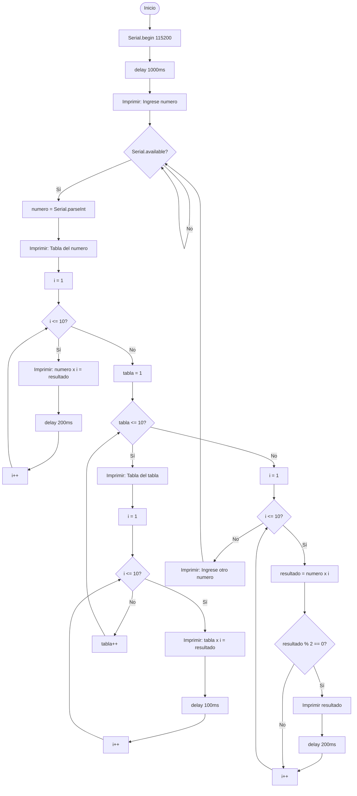

# Taller de Estructuras Cíclicas - ESP32

**Facultad de Tecnología - Ingeniería Mecatrónica**  
**Profesor:** Ing. Jeronimo Jaramillo Bejarano  
**Fecha:** Octubre 29 de 2025

## Autores

- **Miguel Angel Luna Garcia** - Estudiante de Ingeniería Mecatrónica
- **Gustavo Adolfo Quintero Bedoya** - Estudiante de Ingeniería Mecatrónica

## 📋 Objetivo

Comprender y aplicar estructuras de control repetitivas (`for`, `while`, `do-while`) de la programación en lenguaje C para microcontroladores ESP32.

## 🛠️ Requisitos

- **Hardware:** ESP32
- **Software:** Arduino IDE
- **Conexión:** Puerto serie a 115200 baudios
- **Monitor Serie:** Para visualizar resultados e ingresar datos

## 📁 Estructura del Proyecto

```
micros-1-taller-estructuras-ciclicas/
├── ejercicio1_for.ino              # Ejercicio 1: Ciclo For (1 al 10)
├── ejercicio2_while.ino            # Ejercicio 2: Ciclo While (Suma de N números)
├── ejercicio3_dowhile.ino          # Ejercicio 3: Ciclo Do-While (Conteo regresivo)
├── ejercicio4_tabla_multiplicar.ino # Ejercicio 4: Tablas de multiplicar
└── README.md                       # Este archivo
```

---

## 📝 Ejercicios Implementados

### Ejercicio 1: Imprimir números del 1 al 10 usando For

**Descripción:** Programa que imprime números del 1 al 10 usando un ciclo `for`.

**Archivo:** `ejercicio1_for.ino`

**Características:**
- ✅ Conteo progresivo del 1 al 10
- ✅ Conteo regresivo del 10 al 1 (Pregunta 1)
- ✅ Impresión solo de números pares (Pregunta 2)

**Diagrama de Flujo:**



---

### Ejercicio 2: Suma de N números naturales usando While

**Descripción:** Calcula la suma de los primeros N números naturales usando ciclo `while`. N se ingresa por el puerto serie.

**Archivo:** `ejercicio2_while.ino`

**Características:**
- ✅ Entrada de datos por puerto serie
- ✅ Validación de N negativo (Pregunta 2)
- ✅ Suma de todos los números del 1 a N
- ✅ Suma solo de números impares hasta N (Pregunta 1)

**Diagrama de Flujo:**



---

### Ejercicio 3: Conteo regresivo usando Do-While

**Descripción:** Realiza un conteo regresivo del 5 al 1 usando ciclo `do-while`.

**Archivo:** `ejercicio3_dowhile.ino`

**Características:**
- ✅ Conteo regresivo 5 al 1
- ✅ Conteo de 2 en 2 desde 10 (Pregunta 1)
- ✅ Análisis con número inicial = 0 (Pregunta 2)
- ✅ Demostración de ejecución garantizada en Do-While

**Diagrama de Flujo:**



---

### Ejercicio 4: Tabla de multiplicar usando For

**Descripción:** Imprime la tabla de multiplicar del número ingresado por el puerto serie usando ciclo `for`.

**Archivo:** `ejercicio4_tabla_multiplicar.ino`

**Características:**
- ✅ Entrada de datos por puerto serie
- ✅ Tabla de multiplicar del 1 al 10 para el número ingresado
- ✅ Tablas del 1 al 10 con ciclos For anidados (Pregunta 1)
- ✅ Filtro para mostrar solo múltiplos pares (Pregunta 2)

**Diagrama de Flujo:**



---

## 🔧 Instrucciones de Uso

### Configuración Inicial

1. **Abrir Arduino IDE**
2. **Seleccionar placa:** ESP32 Dev Module
3. **Seleccionar puerto:** El puerto COM correspondiente a tu ESP32
4. **Configurar velocidad:** 115200 baudios en el Monitor Serie

### Ejecución de Ejercicios

#### Ejercicio 1 (For)
```
1. Cargar ejercicio1_for.ino en el ESP32
2. Abrir Monitor Serie (115200 baudios)
3. Observar los tres conteos automáticamente
4. Presionar RESET para reiniciar
```

#### Ejercicio 2 (While)
```
1. Cargar ejercicio2_while.ino en el ESP32
2. Abrir Monitor Serie (115200 baudios)
3. Ingresar un número N y presionar Enter
4. Observar el cálculo de sumas
5. Ingresar otro número o presionar RESET
```

#### Ejercicio 3 (Do-While)
```
1. Cargar ejercicio3_dowhile.ino en el ESP32
2. Abrir Monitor Serie (115200 baudios)
3. Observar los conteos regresivos automáticamente
4. Presionar RESET para reiniciar
```

#### Ejercicio 4 (Tablas)
```
1. Cargar ejercicio4_tabla_multiplicar.ino en el ESP32
2. Abrir Monitor Serie (115200 baudios)
3. Ingresar un número para ver su tabla
4. Observar tabla individual, tablas 1-10, y múltiplos pares
5. Ingresar otro número o presionar RESET
```

---

## 💡 Conceptos Clave

### Ciclo For
```c
for (inicialización; condición; incremento) {
    // Código a repetir
}
```
- **Uso:** Cuando se conoce el número exacto de iteraciones
- **Ventaja:** Estructura compacta y clara

### Ciclo While
```c
while (condición) {
    // Código a repetir
}
```
- **Uso:** Cuando el número de iteraciones depende de una condición
- **Ventaja:** Evaluación de condición antes de ejecutar

### Ciclo Do-While
```c
do {
    // Código a repetir
} while (condición);
```
- **Uso:** Cuando se necesita ejecutar al menos una vez
- **Ventaja:** Garantiza al menos una ejecución del bloque

---

## 📊 Respuestas a Preguntas del Taller

### Ejercicio 1

**1. ¿Cómo modificaría el código para contar de 10 a 1?**
```c
for (int i = 10; i >= 1; i--) {
    Serial.println(i);
}
```
Se invierte la inicialización, condición y se usa decremento.

**2. ¿Cómo podría imprimir solo los números pares?**
```c
for (int i = 2; i <= 10; i += 2) {
    Serial.println(i);
}
```
Se inicia en 2 e incrementa de 2 en 2.

### Ejercicio 2

**1. ¿Cómo modificaría el código para sumar solo los números impares hasta N?**
```c
while (i <= N) {
    if (i % 2 != 0) {
        suma += i;
    }
    i++;
}
```
Se agrega una validación para verificar si el número es impar usando el operador módulo.

**2. ¿Qué pasa si N es negativo?**
El programa valida y muestra un mensaje de error, solicitando un número positivo. No tiene sentido matemático sumar números naturales hasta un negativo.

### Ejercicio 3

**1. ¿Cómo modificaría el código para que cuente de 2 en 2?**
```c
int contador = 10;
do {
    Serial.println(contador);
    contador -= 2;
} while (contador >= 1);
```
Se modifica el decremento para restar 2 en cada iteración.

**2. ¿Qué pasa si el número inicial es 0?**
Con `do-while`, el bloque se ejecuta **al menos una vez** antes de evaluar la condición. Por lo tanto, imprime el 0 y luego termina, demostrando la característica principal de esta estructura.

### Ejercicio 4

**1. ¿Cómo modificaría el código para imprimir las tablas del 1 al 10 usando dos ciclos for?**
```c
for (int tabla = 1; tabla <= 10; tabla++) {
    for (int mult = 1; mult <= 10; mult++) {
        Serial.println(tabla * mult);
    }
}
```
Se usa un ciclo for externo para las tablas y uno interno para los multiplicadores.

**2. ¿Cómo modificaría el código para mostrar solo los múltiplos pares?**
```c
for (int i = 1; i <= 10; i++) {
    int resultado = numero * i;
    if (resultado % 2 == 0) {
        Serial.println(resultado);
    }
}
```
Se calcula el resultado y se verifica si es par antes de imprimirlo.

---

## 🎯 Conclusiones

Este taller permite comprender las diferencias fundamentales entre las tres estructuras cíclicas:

1. **For:** Ideal para iteraciones con contador definido
2. **While:** Flexible para condiciones variables
3. **Do-While:** Garantiza al menos una ejecución

Cada estructura tiene su aplicación específica y la elección depende del problema a resolver.

---

## 📌 Notas Adicionales

- Todos los programas incluyen comentarios explicativos
- Se implementan validaciones de entrada donde es necesario
- Los delays son ajustables según preferencia de visualización
- Se recomienda probar diferentes valores de entrada para cada ejercicio

---

**Instrucciones Técnicas:**
- Velocidad Serial: 115200 baudios
- Placa: ESP32 Dev Module
- IDE: Arduino IDE
- Lenguaje: C/C++ para Arduino
